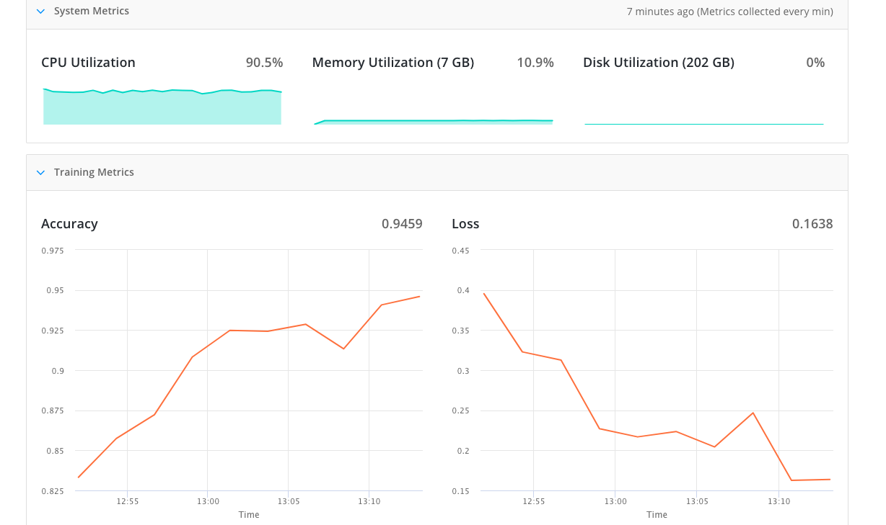

# Movie Sentiment Analysis
## Overview
This neural network reads in a dataset of IMDB reviews ranked on a scale on how positive or negative the reviews are, and learns to predict the sentiment of a review. This model was trained on FloydHub.
## Results

Link - [Results](https://www.floydhub.com/parthiv1024/projects/movie_sentiment_analysis/2)  
## Dependencies
Tflearn - Use this [guide](http://tflearn.org/installation/) to install tflearn
## Usage
First download the movie_sentiment_analysis.py program  
Then create a free account on floydhub and run sudo pip3 install floyd-cli or sudo pip install floyd-cli  
Run floyd login -u <your_username>, and when prompted for your password enter it  
Run floyd init <name_of_project> in the directory where the movie_sentiment_analysis.py is located If it redirects to a web form, fill it and also enter answers to prompts through the cli  
You will get your URL for the project where you can see the results  
Run floyd run python3 movie_sentiment_analysis.py or floyd run python movie_sentiment_analysis.py  
Check it's progress on the URL floydhub.com/<your_username>/projects/<project_name>/n (n should be 1 on the first time)
## Credits
Credits for the code goes to Siraj Raval (||Source||)
